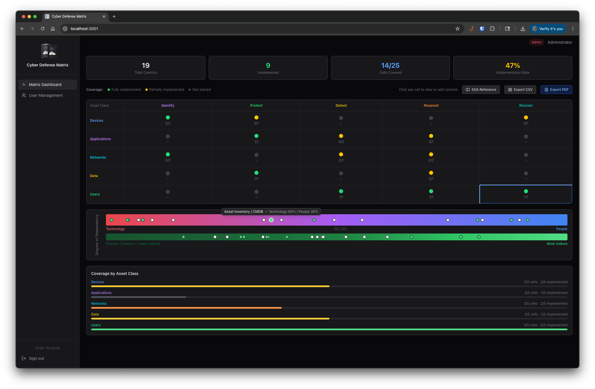
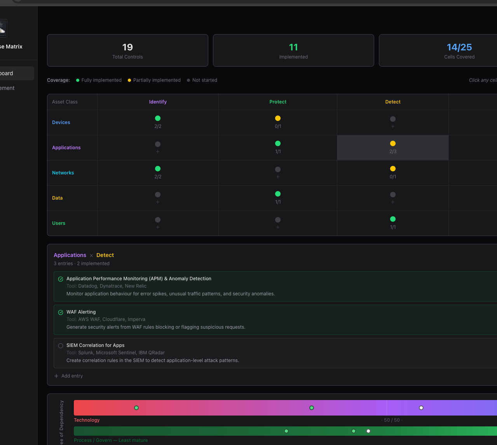
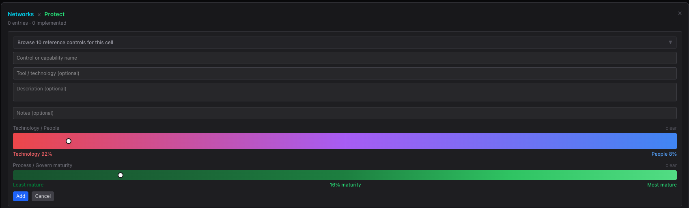
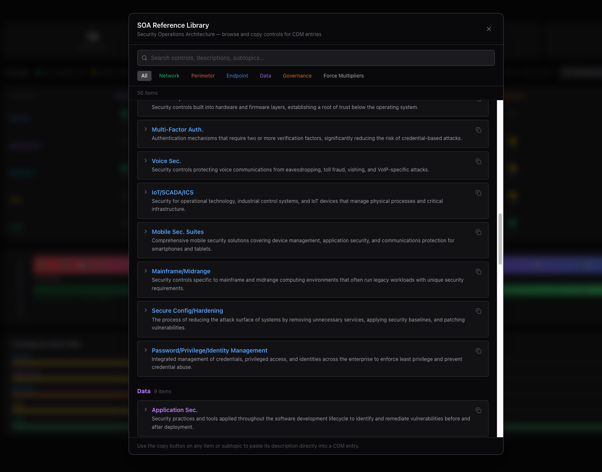
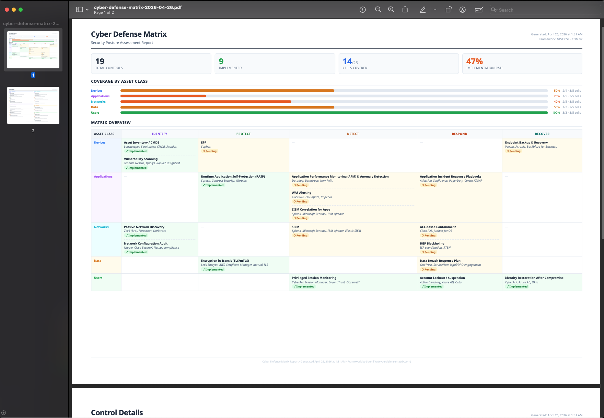

# Cyber Defense Matrix Tool

## What is This App?

The Cyber Defense Matrix Tool is a focused web application for mapping, tracking, and communicating your organization's security controls using the Cyber Defense Matrix (CDM) framework created by Sounil Yu. It gives security teams a single place to document what they have in place, identify where gaps exist, and share that picture with stakeholders without spreadsheets.



---

## Features

### The Matrix Dashboard

The heart of the app is a 5x5 interactive grid. The columns represent the five NIST Cybersecurity Framework functions: **Identify, Protect, Detect, Respond,** and **Recover**, and the rows represent the five asset classes your organization needs to protect: **Devices, Applications, Networks, Data,** and **Users**.

Each cell in the grid represents a specific security domain. For example, the cell where *Devices* meets *Detect* is where your endpoint detection capabilities live. Click any cell to open it and see the controls mapped there, or to add new ones.

Each cell shows a coverage dot at a glance:
- Green - all controls in this cell are implemented
- Yellow - some controls implemented, some still pending
- Gray - no controls defined yet

A summary bar across the top shows total controls, how many are implemented, how many of the 25 cells have coverage, and your overall implementation rate.

---

### Adding and Managing Controls

Clicking a cell opens a panel where you can create, edit, and manage the security controls that belong there. Each control has a title, an optional description, the tool or technology used, and a status toggle to mark it as implemented or pending.

When adding a control, the form includes a **reference suggestions panel** - a curated library of real-world controls relevant to that specific cell, drawn from industry frameworks and common security practice. Clicking any suggestion pre-fills the form so you can adopt it as-is or customize it to fit your environment.



---

### Technology / People / Process Positioning

Every control can be positioned on two independent scales that reflect the CDM's resource continuum:

**Technology to People gradient**
A clickable color bar that lets you indicate how much a given control relies on technology versus people. The dot starts at 50/50 and can be moved left (more technology-dependent) or right (more people-dependent). The split is shown as a live percentage - for example, Technology 70% / People 30% - always summing to 100%.

**Process / Govern maturity scale**
A separate green bar represents how mature the process or governance component of that control is, from 0% (just getting started) to 100% (fully embedded).

Both positions are displayed as dots on a live spectrum bar beneath the matrix. When you open a cell, all of its controls appear on the spectrum, making it easy to see at a glance where your program sits on the people-process-technology continuum.



---

### SOA Reference Library

The **SOA Reference** button opens a searchable Security Operations Architecture reference document. It provides descriptions of common security capabilities organized by category, each with subtopics and a one-click copy button - useful for drafting control descriptions or aligning your language with industry-standard terminology.



---

### Reporting and Export

**Export PDF Report** generates a professionally formatted A3 landscape PDF report containing:
- An executive summary with key statistics and asset class coverage bars
- The full 5x5 matrix overview with color-coded implementation status per cell
- A detailed two-column breakdown of every control organized by asset class and NIST function, including tool, description, and notes

**Export CSV** downloads all controls as a flat spreadsheet for use in Excel, Google Sheets, or any reporting tool. Columns include asset class, NIST function, title, description, tool, implementation status, notes, created by, and date.

Both exports are available to all users regardless of role.



---

<details>
<summary><strong>User Management and Account Settings</strong></summary>

### User Management

Administrators can manage team access from the **User Management** page. Three roles are available:

- **Admin** - full access including user management
- **Editor** - can create, edit, and delete controls, and export
- **Viewer** - read-only access and export; cannot modify controls

Admins can create new users, change roles, deactivate accounts, reset passwords, and require MFA enrollment for individual users.

### Account Settings

Every user can access their account settings by clicking their name in the top-right corner of the app. From there they can:

- **Change their password** - requires the current password to confirm
- **Set up two-factor authentication (MFA)** - uses a TOTP authenticator app such as Google Authenticator or Authy

**Setting up MFA:**
1. Click your name in the top-right corner and go to Account Settings
2. Scroll to the Two-Factor Authentication section and click **Set up MFA**
3. Scan the QR code with your authenticator app, or enter the text key manually
4. Enter the 6-digit code shown in your app to verify and activate MFA
5. On future logins, you will be prompted for a code after entering your password

**If an administrator has required MFA for your account:**
When you next log in, you will be directed to Account Settings automatically and prevented from accessing the rest of the app until MFA is set up. Once you complete enrollment and verify a code, the app will sign you out and prompt you to log back in. After logging back in, full access is restored.

**Disabling MFA:**
MFA can be disabled from the Account Settings page by entering your current password to confirm. Note that if your administrator has required MFA for your account, disabling it will restrict your access again on your next login.

</details>

---

<details>
<summary><strong>Installation Guide</strong></summary>

This app runs entirely inside Docker, a tool that packages the application so it works the same way on any computer. You do not need to install Node.js, a database, or any programming tools. Docker is the only thing you need.

### Step 1 - Install Docker Desktop

Docker Desktop is a free application that lets you run containerized apps like this one.

**On a Mac:**

Go to [https://www.docker.com/products/docker-desktop](https://www.docker.com/products/docker-desktop)

**On Windows 11:**

Go to [https://www.docker.com/products/docker-desktop](https://www.docker.com/products/docker-desktop)

### Step 2 - Get the project

Download and extract the ZIP file, or clone the Git repository.

### Step 3 - Generate two secret keys

The app requires two separate secret keys; one for securing login sessions and one for encrypting the database. Run the key generation command **twice** to get two different values.

- (Mac) - In the **Terminal** app, run this command twice and copy each result:
   ```
   openssl rand -base64 32
   ```
- (Windows) - Open *PowerShell* and run this command twice and copy each result:
   ```
   [Convert]::ToBase64String((1..32 | ForEach-Object { [byte](Get-Random -Max 256) }))
   ```

### Step 4 - Add your secret keys to the app

Open `docker-compose.yml` in the project folder and replace both placeholder values, keeping the quotes. Use a **different value for each** — do not use the same key for both.

```
NEXTAUTH_SECRET: "paste-your-first-generated-key-here"

DB_ENCRYPTION_KEY: "paste-your-second-generated-key-here"
```

> The `DB_ENCRYPTION_KEY` encrypts your database file on disk. If you lose this key you will not be able to read your data, so store it somewhere safe such as a password manager.

### Step 5 - Start the app

Navigate to the project folder and run:
```
docker compose up --build
```

The first time you run this, it will take **3 to 5 minutes** to download and build everything.

### Step 6 - Open the app

Open any web browser and go to:

```
http://localhost:3001
```

Sign in with the default credentials:

- **Email:** `admin@cdm.local`
- **Password:** `ChangeMe123!`

> You should change the default password after your first login via the User Management page.

### Starting and stopping the app

To **stop** the app, use `Control + C`.

To **start** it again later, run `docker compose up` without `--build`, which makes it much faster.

### Your data

Your data is stored as an AES-256 encrypted file called `cdm.db.enc` inside the `data` folder in the project directory. The file is unreadable without the `DB_ENCRYPTION_KEY` set in `docker-compose.yml`. To back up your data, copy `cdm.db.enc` somewhere safe along with your `docker-compose.yml` so you retain the decryption key. To restore, copy both files back and start the app.

</details>

---

<details>
<summary><strong>Security</strong></summary>

**Security Hardening**

- `X-Frame-Options: DENY` - no clickjacking via iframes
- `X-Content-Type-Options: nosniff` - no MIME sniffing
- `Content-Security-Policy` - blocks loading scripts/styles/images from other origins
- `Permissions-Policy` - disables camera, mic, geolocation
- Passwords bcrypt-hashed at cost 12
- Database AES-256 encrypted at rest
- TOTP MFA with admin-enforced enrollment
- Server-side RBAC on every action and route
- Non-root Docker user
- JWT sessions (no server-side session store to attack)

**Rate Limiting**

- 10 failed login attempts per IP per 15 minutes
- 10 failed attempts per email address per 15 minutes (blocks distributed attacks targeting one account)
- Sessions expire after 8 hours

**HTTP / HTTPS**

- **Local use:** The app runs over HTTP on `localhost`. Traffic never leaves your computer. The database is AES-256 encrypted on disk regardless of whether you use HTTP or HTTPS.

- **Shared/networked deployment:** If you deploy this on a server and your team accesses it over a network, HTTPS is strongly recommended. A `docker-compose.prod.yml` and `Caddyfile` are included in the project. Point a domain name at your server, edit the domain in both files, and run `docker compose -f docker-compose.prod.yml up --build`. Caddy will handle obtaining and renewing a free TLS certificate automatically. No certificate management required.

</details>

---

## Credits

The Cyber Defense Matrix framework was created by [@sounilyu](https://x.com/sounilyu).
